# sinchon-food-BDA

### ♠ The aim of this project
This is a website where you can write and share reviews about restaurants.This service analyzes students' preferences in restaurants around Ewha university using the stores’info and reviewed data. 

### ♠ Images of Website Page
1. Main page
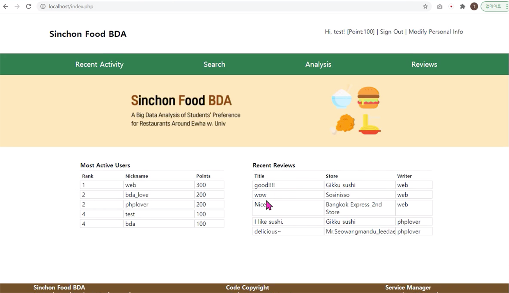 
2. Sign up
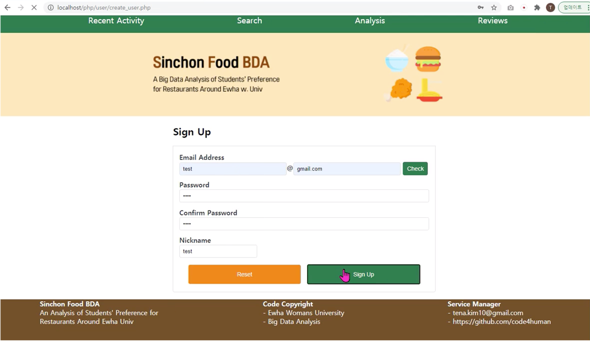 
3. Sign in
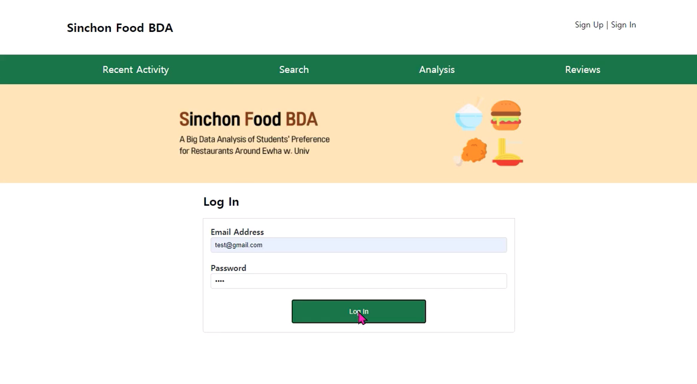 
4. Search the stores and menus
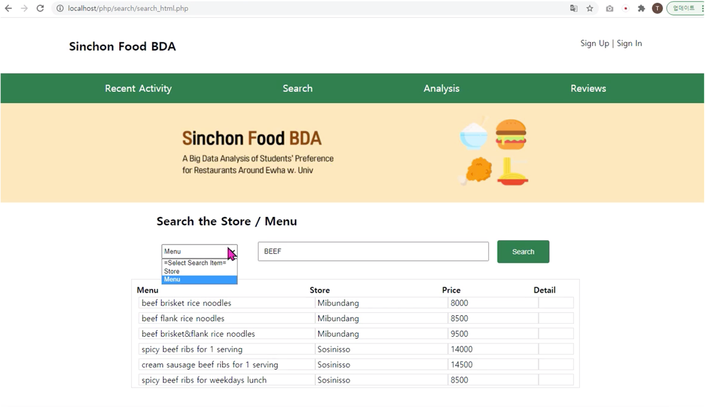 
5. Get one of one of the written reviews
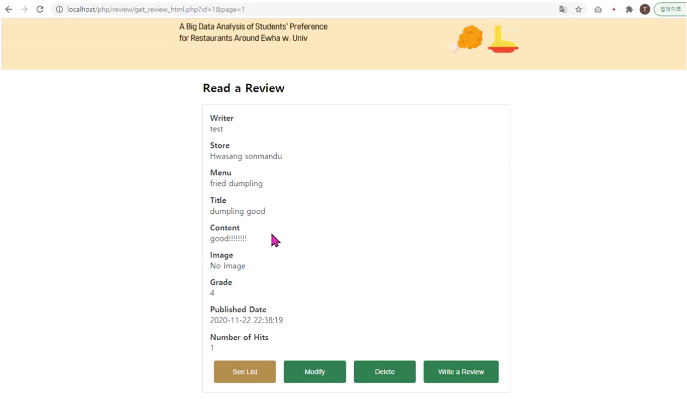
6. Analyze of service data
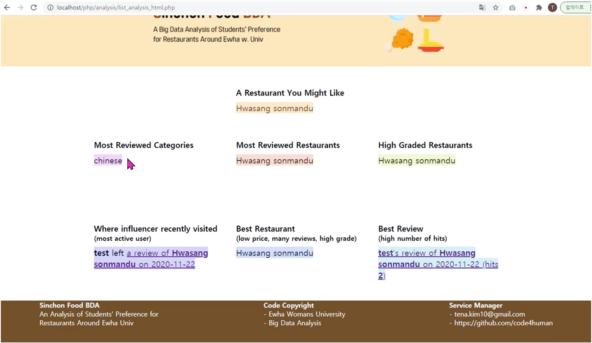 

### ♠ E-R Diagram
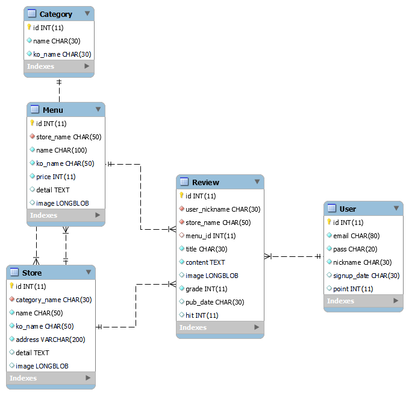 

### ♠ File Structure
#### Direcory of `php`
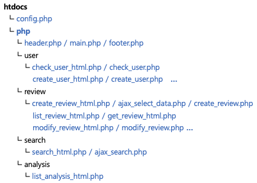 

- `config.php` contains the DB settings info.

- In `php` directory, there are the common files for website’s header, main section and footer.

- The functions and template files are organized by each other directory – `user`, `review`, `search`, `analysis`. 

- Files containing role of html are attached the suffix `‘_html’` in the file name.

- Through many `php` files, `INSERT`, `DELETE`, `UPDATE`, `SELECT` in the website are used.

#### Direcory of `sql`, `js`, `css`
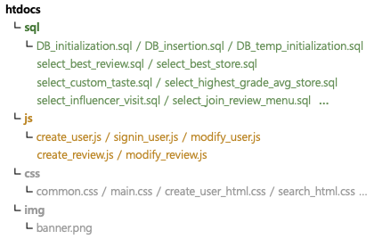 

- `DB_initialization.sql` contains the script for creating database and tables. 

- `DB_insertion.sql` is for inserting table data. `DB_temp_insertion.sql` is to insert the temporary data about user and review for presentation.

- Simple and short sql scripts were used directly within the `php` file, only the complex or long ones(`RANK`, `COUNT`, `MAX`, `AVG`, `PARTITION BY`, `GROUP BY`, `JOIN`) were separated into sql files.

- Javascript code is necessary to check the html form data and alert to user before executing sql queries.

- Styles were applied to websites for good usability.

### ♠ File Information
##### Files for DB Configuration (included by many other files)
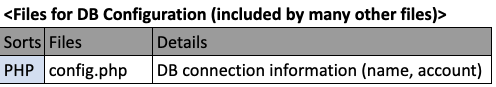 
##### Files for Main Page on the website 'Recent Activity' Tab
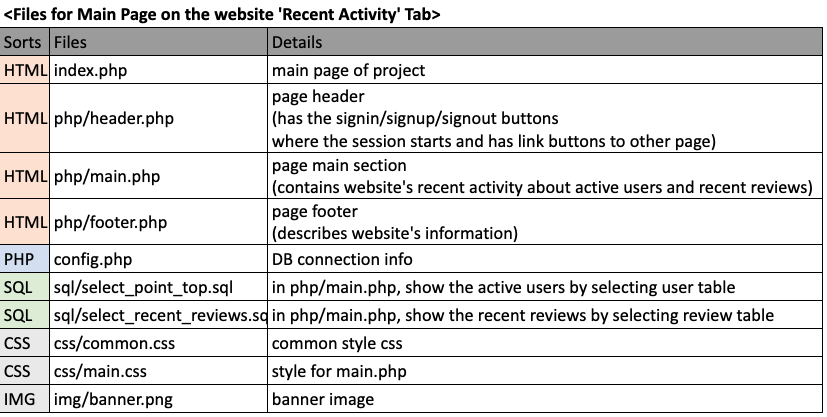 
##### Files for Signup Page on the website header
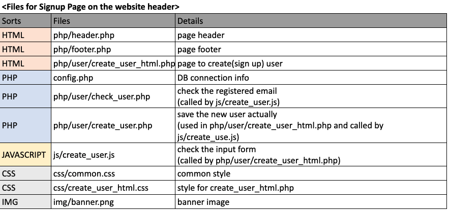 
##### Files for Signin Page on the website header
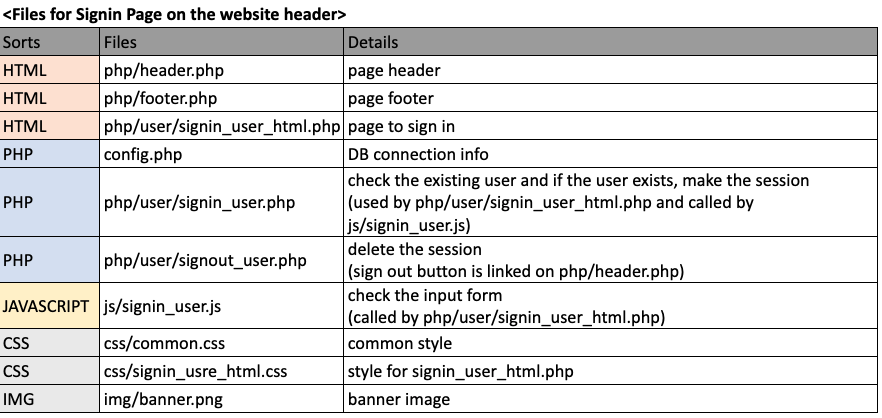 
##### Files for Modify User Info Page on the website header
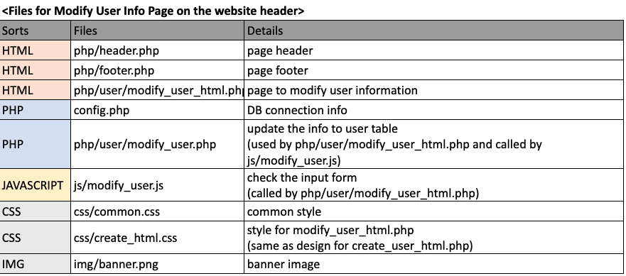 
##### Files for Write a Review on the website 'Review' Tab
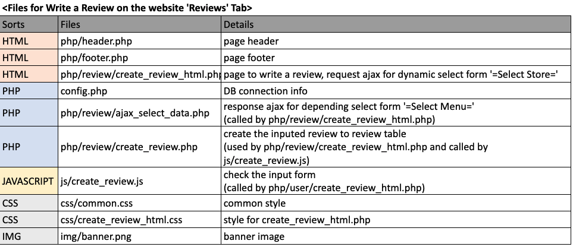 
##### Files for List Reviews, Get one Review on the website 'Reviews' Tab
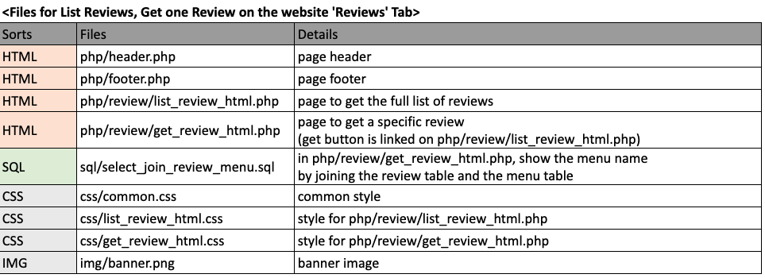 
##### Files for Modify and Delete Review on the website 'Reviews' Tab
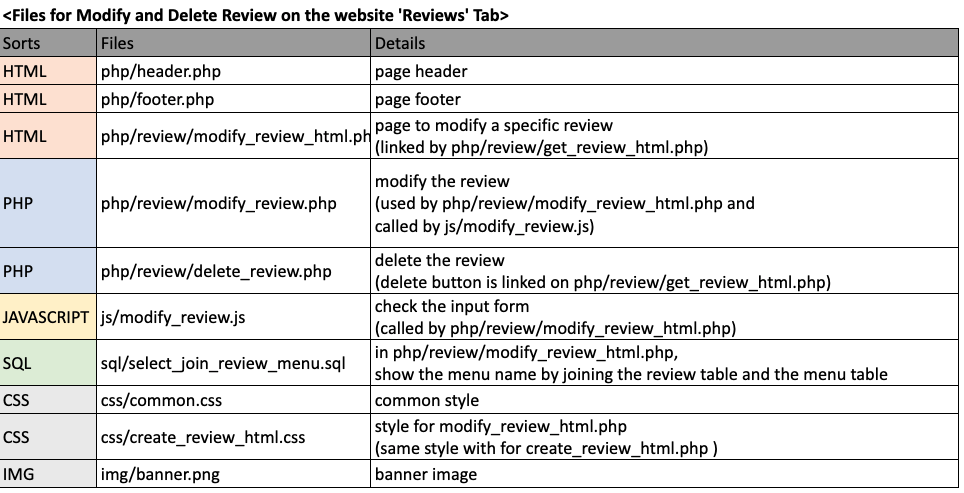 
##### Files for Search on the website 'Search' Tab
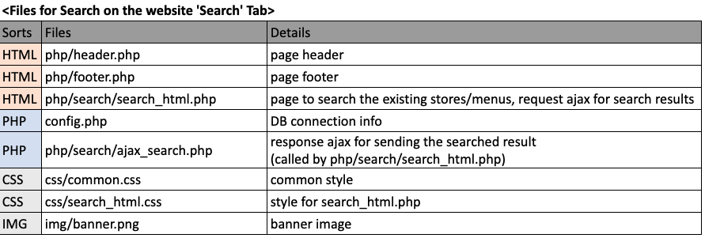 
##### Files for List Analysis on the website 'Analysis' Tab
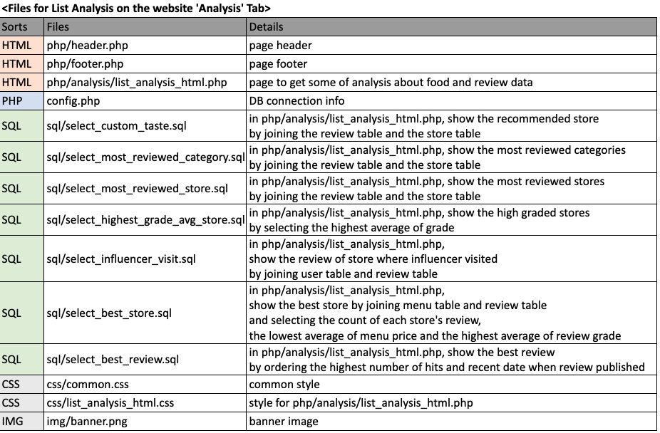 